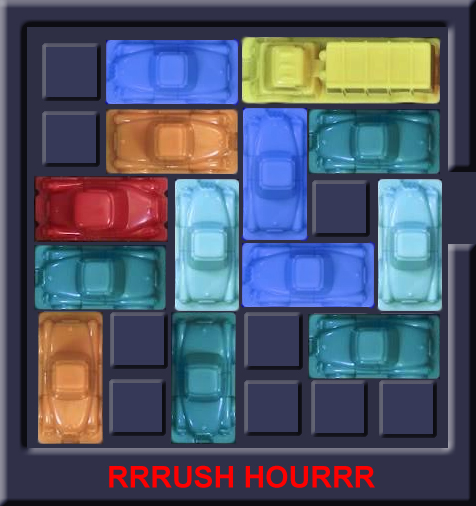

# Rush Hour Project
##### Team Lightning Mcqueen: Tünde de Vries, Jeroen van der Borgh & Hanne Brouwer

## Case description
Rush hour is a puzzlegame in which the objective is to move the red car to the exit of the board.
However, on the board are several vehicles blocking the path of the red car to the exit.
These vehicles can be cars, that cover 2 spaces on the board, or trucks, that cover 3.

In this case 7 different gameboards were given.
These 7 boards differ in size: the first 3 boards are 6x6, board 4 to 6 are 9x9, and board 7 is 12x12.
The boards also vary in difficulty to solve and statespace (how many boardstates are possible: the possible moves per turn ^ the number of moves made).

The objective in this case is to create an algorithm that is able to find the solution on each board with the smallest possible number of moves.
The difficulty of implementing an algorithm on the boards varies per board, as the statespace and difficulty is different for each board.

#### Terminology
Short explanations on the terminology used in this readme and repository:
- Car = in this readme and repository used to signify vehicles (of length 2 and 3)
- Move = combination of car and number of steps (negative or positive to signify direction)
- Boardstate = specific set up of vehicles on the board

## Algorithms

In the following section we describe the algorithms that are implemented to find solutions to our case.

### Random
The random algorithm solves a board by doing random moves. It does this by picking a random move out of all currently possible moves, and checking after each move whether the game was won. If the number of randomly made moves exceeds the parameter <code>max_moves</code> it will restart the algorithm, and try again from the beginning position. Seen as the algorithm is random, the time to find a solution varies. High values for <code>max_moves</code> can give much faster results, and low values could potentially take very long. This algorithm is usefull for quickly finding solutions, when the quality of the solution is not very important.

### Optimalise
This algorithm consists of two parts. Firstly, the random algorithm is used to create random solutions. Secondly, the **improve solution algorithm** is applied to the found solutions. This algorithm is an iterative algorithm, meaning it takes an existing solution and tries to improve it, by removing unnecessary moves and restructering them. It does so by the following processes:

- **Remove useless moves**
makes changes to the original solution and then tests if the solution is still valid. It does this by going through the moves **4** times. For every move it tries to find a partner (a later move made by the same car), to form a pair. In the first iteration, steps of a pair both get set to 0 (to eliminate cars needlessly moving back and forth). If the solution is still valid the moves are useless, and can be removed. The second and third iteration, the pairs get combined into a single move (by adding the steps together), this total move replaces the first and second move of the pair respectively (while the other is set to 0). Lastly all moves are removed individually to see if any is unnecessary.

- **Remove inaccuracies**.
An inaccuracy is defined as a vehicle moving in the same direction twice in a row with moves of other vehicles in between. All the pairs of moves that do this are called canidates, because not every inaccuracy is actually inacurate. Because the useless moves are removed before this you can't just combine these. To solve this the two moves are moved closer to eachother. This is done by changing the order of moves, so that the first move gets closer to the second, untill the solution becomes invalid. When we reach this, the first move and the one directly following it are moved together , as a chunk. This repeats until the chunk touches the second move. After this is done for all the canidates remove useless moves is ran again. 
Note that because things get moved around it can happen that canidates are not in their original position and thus other moves are moved around. This didn't apear to be happening often and fixing it might lead to longer run time instead of faster.

Running the algorithm exactly like described above will work, but to speed it up, the solution is cut into parts. The total algorithm does the following:
1. remove useless moves is ran on chunks of size 10. And stops when the improvement is below a treshold, currently on 50.
2. remove inaccuracies is ran on chunks of size 30. And stops when there is no improvement. Note that remove useless moves is also inside this.
3. remove useless moves while increasing the chunk size every cycle with 2 until it is more than half the size of the solution. Currently starting with chunk size 10.
4. remove useless moves of the whole solution.
5. remove inaccuracies in the whole solution.

This algorithm works quite fast, and can create relatively good solutions. The advantage of this algorithm is that it does not have to search through any statespace, and thus it is still usable for much bigger, and more complex boards. However, it is not guaranteed to find optimal solutions since some mor complex needless moves are not filtered out.

### Depth first search
The depth first search algorithm is a constructive algorithm, meaning it creates a solution out of itself. It goes through the states, by searching the first child of the parent state (search here means examining/searching all child states), before moving to the second child. It searches up to a given depth (number of moves), this depth can be statically set, or dynamically determined to be one shorter than the shortest solution found so far.
To prune the statespace a (smart) archive is used. This archive keeps track of the boardstates that have been previously visited. By also keeping track of the number of moves needed to get to each state, it is ensured that the states in archive are reached in the shortest amount of moves found so far. This ensures that the shortest solution can be found. 
It is also possible to prune the statespace even further by use of a filter. This filter looks at existing solutions of the current board (given by the user) and finds which cars do not move in any of the solutions. These cars are then skipped, when looking for possible moves. 

This algorithm is very useful, when you want to ensure the quality of the solution. When run completely, it will always find the shortest possible solution. The downfall however, is that it is very slow, since it does an almost exhaustive search of statespace.

## Usage
In the section below is described how to create various results from the code in the repository. 

### main&#46;py

All the code that was used to create results can be accessed and run through main&#46;py. The command line code to run the program is structured as follows:

<code>python main&#46;py [board number] [algorithm name] </code>

For <code>board number</code>, an integer between 1 and 7 is expected, indicating wich board you would like to be run. 
The field <code>algorithm name</code> expects one of the following inputs:

- <code>random</code>
- <code>optimalisation</code>
- <code>depth_first</code>
- <code>play</code>

#### random
If this option is chosen the user is asked for additional inputs:

- <code>Number of attempts</code> expects an integer number, indicating how many random solutions will be looked for (e.g. filling in 5 will return 5 solutions)
- <code>Maximum moves</code> expects and integer number, indicating what the bound is for random solutions. (e.g. filling in 100 will only return solutions of less than 100 moves)
- <code>Log solution</code> expects either <code>y</code>(es) or <code>n</code>(o), indicating whether the solutions will be logged. Entering <code>y</code> will create a csv file with the found solution under <code>data/logs/random_board[board number].csv</code>

If all information is filled correctly, the algorithm will be run.

#### optimalisation
If this option is chosen the user is asked for additional inputs:

- <code>Number of attempts</code> expects an integer number, indicating how many solutions will be looked for (e.g. filling in 5 will return 5 solutions)
- <code>Maximum moves</code> expects and integer number, indicating what the bound is for the random solutions. (a high number will improve the speed of the random part of the algorithm, and decrease that of the improvment algorithm)
- <code>Create animation</code> expects either <code>y</code>(es) or <code>n</code>(o), indicating whether the solutions will be logged. Entering <code>y</code> will create a gif file with the found solution animated under <code>data/results/[index of solution].gif</code>
- <code>Log solution</code> expects either <code>y</code>(es) or <code>n</code>(o), indicating whether the solutions will be logged. Entering <code>y</code> will create a csv file with the found solution under <code>data/logs/[index of solution].csv</code>

If all information is filled correctly, the algorithm will be run.

#### depth_first
If this option is chosen the user is asked for additional inputs:

- <code>Maximum moves</code> expects and integer number, indicating what the bound is for the solutions. State space will be searched up to this depth
- <code>Dynamic bound</code> expects either <code>y</code>(es) or <code>n</code>(o). Entering <code>n</code> will limit the depth_first algorithm at a fixed depth (namely, at the maximum moves). Entering <code>y</code> will dynamically change the maximum search depth to the shortest solution that was found so far (thus decreasing the statespace).
- <code>Print all</code> expects either <code>y</code>(es) or <code>n</code>(o). Entering <code>y</code> will cause all found solutions to be printed in the terminal. 
- <code>Log solution</code> expects either <code>y</code>(es) or <code>n</code>(o), indicating whether the solutions will be logged. Entering <code>y</code> will create a csv file with the found solution under <code>data/logs/depth_first[board_number].csv</code>
- <code>Create animation</code> expects either <code>y</code>(es) or <code>n</code>(o), indicating whether the solutions will be logged. Entering <code>y</code> will create a gif file with the found solution animated under <code>data/results/depth_first[board_number].gif</code>
- <code>Filter</code> expects either <code>None</code> or <code>a list of solution movesets</code>. Entering <code>a list of solution movesets</code> will look at the solutions, and extract cars that do not move throughout any of the found solutions. Branches where these cars are moved are pruned in the algorithm to reduce running time. Entering <code>None</code> will not affect the algorithm.

If all information is filled correctly, the algorithm will be run. The best solution (if any solution exists) will be printed at the end.

#### play

This options allows the user to play the chosen gameboard directly in the terminal. If it is chosen, the user is repeatedly asked for a <code>Car</code>, for which a car id (e.g. "X") is needed, and for a step (e.g. -1) indicating the number of steps the car should take. (negative is up/left, positive is down/right)

